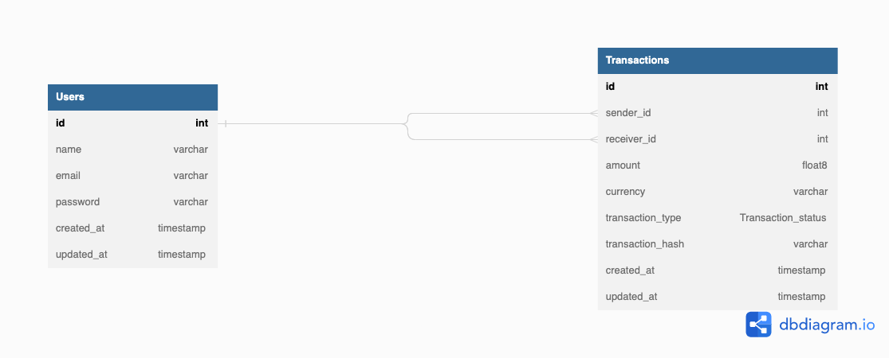

# About
This project mocks a wallet app that allows users to sign up, login, see other users if authenticated, fund their wallet, withdraw, transfer to other users.

Written in typescript and using KnexJS as a query builder.

KnexJS is a query builder library not a full fledged ORM, to cover for solutions ORM provide, Objection.js was built on KnexJS as an ORM and thus was used in this project. This way I get to interact with database records as objects with methods and not just plain javascript objects (POJO)

## Postman Documentation:
https://documenter.getpostman.com/view/12165874/2s83zpK1Sm

## Database Structure


## Installations

### Requisite Softwares
 - [NodeJS](https://nodejs.org/en/download/)
 - [Git](https://git-scm.com/downloads)
 - [MySQL](https://dev.mysql.com/downloads/mysql/)
 - [Postman](https://www.postman.com/downloads/) (or any REST Client)

### Environment setup

``` sh
$ git clone git@github.com:Goziecodes/lendsqr.git
$ cd lendsqr
$ npm install
```
You have to first create a database on your MySQL, based off the value you use for the `DATABASE` environment variable


Add your mysql connection credentials to .env. Refer to the `env.example` file for values to use

```sh
$ npm run migration:run # run migrations and create neccesary tables

$ npm run dev # start the app locally
```


## Deployment Process

The app is deployed to heroku, using Github Action CI/CD and is triggered by a push to the `master` branch.

Steps used to deploy:


- create a new heroku app

- put the heroku app name on the heroku_app_name field of pipeline.yml 

- add .env credentials to the config vars section

- on github goto setting -> secrets -> actions and add the following

    * key: "DEPLOY_EMAIL" value: 'your heroku_email'
    * key: "HEROKU_API_KEY" value: 'your heroku_api_key'
    * key: "ENV": value:  'refer to the env.example'

- Note: value for ENV key is your .env configs

## Testing

```sh
$ npm run test # run unit tests

$ npm run test:cov # run test coverage
```


